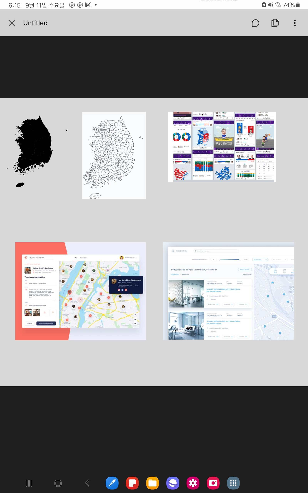

# 2024.09.11 기획 회의

| **항목**    | **내용**        |
|-----------|---------------|
| **회의 목록** | 파이널          |
| **장소**    | 비트캠프          |
| **날짜**    | 2024년 9월 11일  |
| **시간**    | 18:00 ~ 19:10 |
| **작성자**   | 이가람, 황민지      |

- **참석자**

| **이선아** | **장혜정** | **이가람** | **황민지** | **이태정** | **김주연** |
| --- | --- | --- | --- | --- | --- |
| **O** | **O** | **O** | **O** | **O** | **O** |

 

### 🏷️ 회의 정리

---

1. **UI 프로토타입 발표 및 아이디어 선정**
    - 혜정
        - 여행사진 + 지도 페이지 UI 프로토타입 발표
        - 메인에 지도가 걸려있으면 너무 부담 → 도 별로 구분하여 클릭 시 상세하게 노출되게 하자.
    - 가람
        - 코딩 초보자들을 위한 멘토와 함께하는 프로젝트 모집 페이지 UI 프로토 타입 발표
        - 코딩 편차에 따른 관계도 및 현재 구현 가능한 툴 그래프화
    - 선아
        - 여행사진 + 지도 페이지 UI 프로토타입 발표
        - 카테고리 별로 나뉘어있는 UI → 지도 Tap 시 지도 위에 작성 폼 노출
    - 태정
        - 메모리 퍼즐 UI 프로토타입 발표
        - 사용자가 올린 사진의 순서대로 폴라로이드 및 퍼즐에 사진을 배치해 볼 수 있음
    - 주연
        - 여행 마그네틱 + 지도 페이지 UI 프로토타입 발표
        - AI를 도입하여 내용을 분석해 관련된 이미지를 지도 위에 부착
    - 민지
        - 여행사진 + 지도 페이지 UI 프로토타입 발표
        - 지도 공유 게시글 및 자유 게시글 페이지가 있는 UI
    - 공통
      - 포토 로그 - 거의 똑같은 iOS 어플 존재 벤치마킹 가능
      - 해당 어플은 3년 전 최종 업데이트 후 더 이상 업데이트가 없음
      - 우리가 디벨롭하자.

      
   
      여행 사진 + 지도 페이지 아이디어 확정

2. 여행 사진 아이디어 추가 논의
   - 유사 어플 → 포토로그
      - 거의 유사한 iOS 어플. 벤치마킹 가능
      - 해당 어플은 3년 전 업데이트가 마지막
      - 우리가 디벨롭하자

### 🏷️ 회의 결과

---

- 아이디어 확정 : 여행사진 + 지도 기록 페이지
- 기본 UI 확정

### 🏷️ 다음 회의 주제

---

- 기본 UI + 나왔던 아이디어들 중 장점이 있던 부분 더하기
- 현황 및 문제점과 해결방안과 이점에 대해 생각해오기

### 🏷️ 업무

[// 체크박스]: # ([ ], [x])

---

>⛔
**장혜정**
>- [x]  **아이디어 도출 및 아이디어의 핵심 기능 UI 프로토타입 만들기**  
>- **핵심 기능 UI 프로토타입** 
> 

>🔒
**이선아**
>- [x]  **아이디어 도출 및 아이디어의 핵심 기능 UI 프로토타입 만들기**  
>- **핵심 기능 UI 프로토타입**  
> [map.pdf](선아-20240911.pdf)

>✂️
**이가람**
>- [ ]  **아이디어 도출 및 아이디어의 핵심 기능 UI 프로토타입 만들기**  
>- **핵심 기능 UI 프로토타입** 
> [https://www.figma.com/proto/NwflFwDDBZU4Cll0LsPMyz/Untitled?node-id=0-1&t=Dk0qLiL3YlSByaWi-1](https://www.figma.com/proto/NwflFwDDBZU4Cll0LsPMyz/Untitled?node-id=0-1&t=Dk0qLiL3YlSByaWi-1)

>😄
**황민지**
>- [x]  **아이디어 도출 및 아이디어의 핵심 기능 UI 프로토타입 만들기**  
>- **핵심 기능 UI 프로토타입** 
> [https://www.figma.com/proto/DqNrDkuPlIYNYS6SqX2yrW/UI-%EB%94%94%EC%9E%90%EC%9D%B8?node-id=9-237&node-type=canvas&t=yjNpc40JKzjz3aoV-0&scaling=min-zoom&content-scaling=fixed&page-id=0%3A1&starting-point-node-id=9%3A237](https://www.figma.com/proto/DqNrDkuPlIYNYS6SqX2yrW/UI-%EB%94%94%EC%9E%90%EC%9D%B8?node-id=9-237&node-type=canvas&t=yjNpc40JKzjz3aoV-0&scaling=min-zoom&content-scaling=fixed&page-id=0%3A1&starting-point-node-id=9%3A237)

>👉🏽
**이태정**
>- [x]  **아이디어 도출 및 아이디어의 핵심 기능 UI 프로토타입 만들기**  
>- **핵심 기능 UI 프로토타입** 
> 

>📖
**김주연**
>- [x]  **아이디어 도출 및 아이디어의 핵심 기능 UI 프로토타입 만들기**  
>- **핵심 기능 UI 프로토타입**