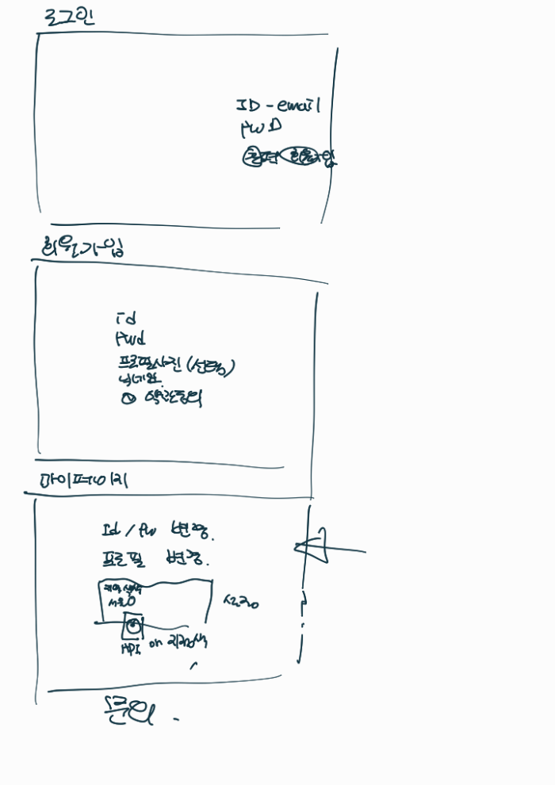
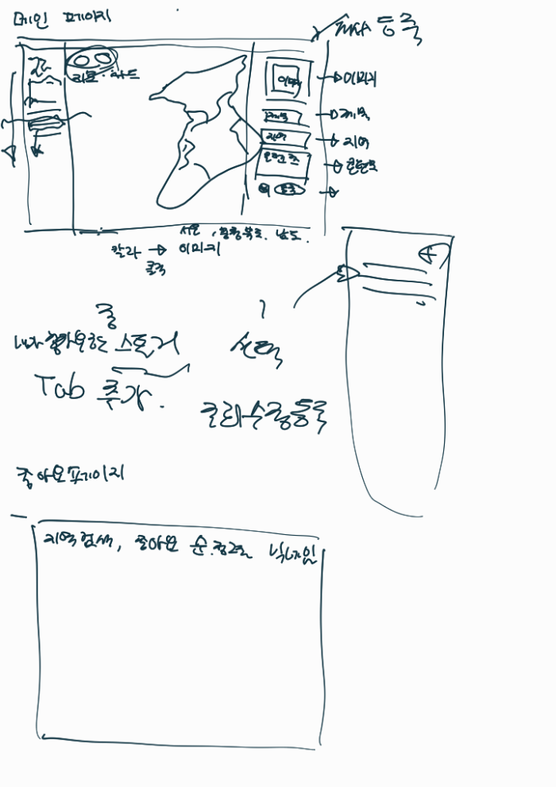
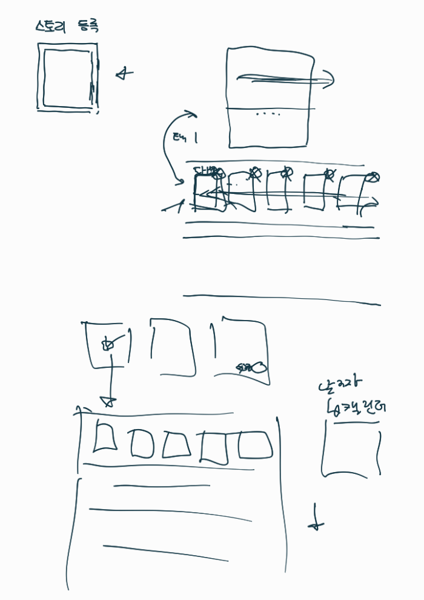
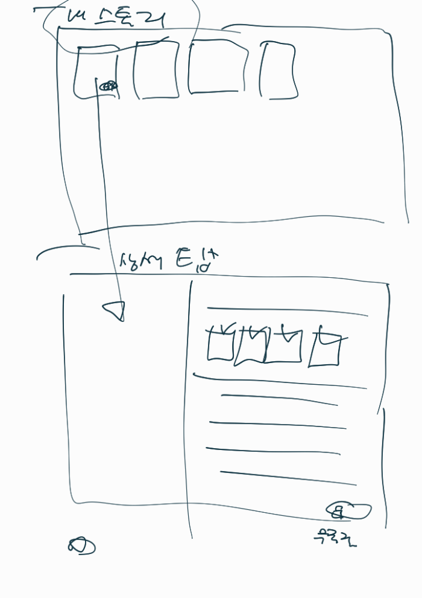
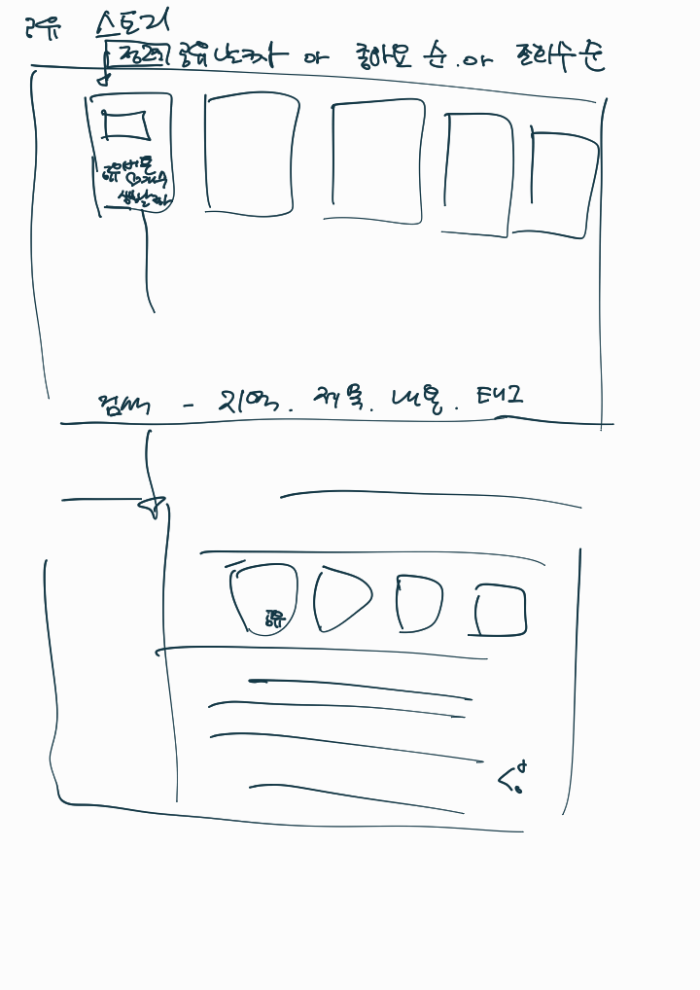

# 2024.09.23 업무 회의

| **항목**    | **내용**     |
|-----------|------------|
| **회의 목록** | 파이널        |
| **장소**    | 비트캠프       |
| **날짜**    | 2024년 9월 23일 |
| **시간**    | 16:00~     |
| **작성자**   | 장혜정     |

- **참석자**

| **이선아** | **장혜정** | **이가람** | **황민지** | **이태정** | **김주연**                            |
|---------|---------|---------|---------|---------|------------------------------------|
| **O**       | **O**       | **0**   | **O**       | **O**       | **O** |

 

### 🏷️ 회의 정리

---

1. Use Case 모델링
   - 기능별 Use Case 다이어그램 작성.
     - Administrator: 로그인, 회원관리, 스토리 관리 
     - User: 마이페이지, 로그인, 메인, 공유 스토리
      
      
      
      
      

2. Use Case 발표
   - 발표자: 김주연

### 🏷️ 회의 결과

---

### 🏷️ 다음 회의 주제

---

- UI 프로토타입 작성: 고급 와이어프레임, 최종 UI 디자인 등

### 🏷️ 업무

[// 체크박스]: # ([ ], [x])

---

>⛔
**장혜정**
>- [x]  **PPT 발표 자료 검토**

>🔒
**이선아**
>- [x]  **(불참 - 개인 일정)**

>✂️
**이가람**
>- [x]  **UI 프로토타입 디자인 피그마 컴포넌트화**

>😄
**황민지**
>- [x]  **UI 프로토타입 수정**

>👉🏽
**이태정**
>- [x]  **PPT 작성 및 수정**

>📖
**김주연**
>- [x]  **PPT 작성 및 수정**