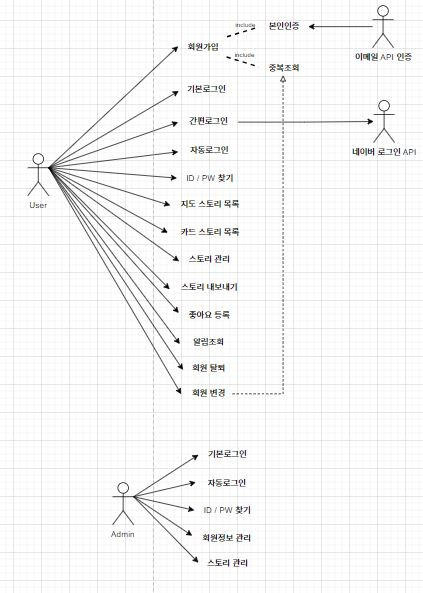

# 2024.09.24 업무 회의

| **항목**    | **내용**     |
|-----------|------------|
| **회의 목록** | 파이널        |
| **장소**    | 비트캠프       |
| **날짜**    | 2024년 9월 24일 |
| **시간**    | 16:30~     |
| **작성자**   | 이태정     |

- **참석자**

| **이선아** | **장혜정** | **이가람** | **황민지** | **이태정** | **김주연**                            |
|---------|---------|---------|---------|---------|------------------------------------|
| 불참(건강이슈)       | **O**       | **0**   | **O**       | **O**       | **O** |

 

### 🏷️ 회의 정리

---

#### 이전에 작성한 Use_case의 피드백을 확인하고 회의를 통하여 더나은 방향을 도출

**이전에 사용한 Usecase의 문제점**

1. 로그인 회원가입
    - 아이디랑 비번은 회원가입의 한 흐름이기에 굳이 넣을 필요는 없다.
    - 닉네임 생성 같은 경우는 중복조회를 통해 따로 빼는것이 가능하다.
    - 자동 로그인은 로그인에 대한 흐름이기에 굳이필요 없다.

2. 마이페이지
    - 위랑 비슷하다.

3. 메인페이지
    - 지도 보기가 아니라 여행스토리 관리 / 지도로 스토리 조회하기 / 카드로 스토리 조회하기가 맞다.
    - 스토리 검색 안에 옵션 지우기
    - 스토리정렬을 스토리 목록에 포함시킬 수 있다.
    - 스토리 내보내기에 공개는 안에 포함 되어있으니 뺀도 된다.

4. 공유 스토리
    - 공유 스토리 조회가 아닌 스토리 조회로 바꾼다.
    - 스토리 내보내기는 외부 액터가 필요 없음
    - 외부가 개입이 되는 acter는 마우스나 키보드를 쓰든 뭐든 해야 되는데 그걸 해야 개입이 된다.
    - 좋아요 버튼이 아니라 좋아요 등록하기로 수정하면 좋을 것 같다.

이를 바탕으로 수정하였다

### 🏷️ 회의 결과

---
결론 : 수정방향은 불필요한 acter를 줄이고 세분화 하였던 기능들의 흐름을 줄이며 불필요한 기능들을 삭제하여 Usecase를 더 간결하게 만든다.

 그리고 회의를 통하여 좋아요를 통해 게시글 작성자에 알림이 전달되는 알림기능과 회원가입시에 인증절차가 부족하다는 의견을 수렴하여 이메일을 통한 본인인증 기능을 추가하였다.

 - 발표자: 황민지

### 🏷️ 다음 회의 주제

---

- 최종 UI 프로토타입 발표 준비